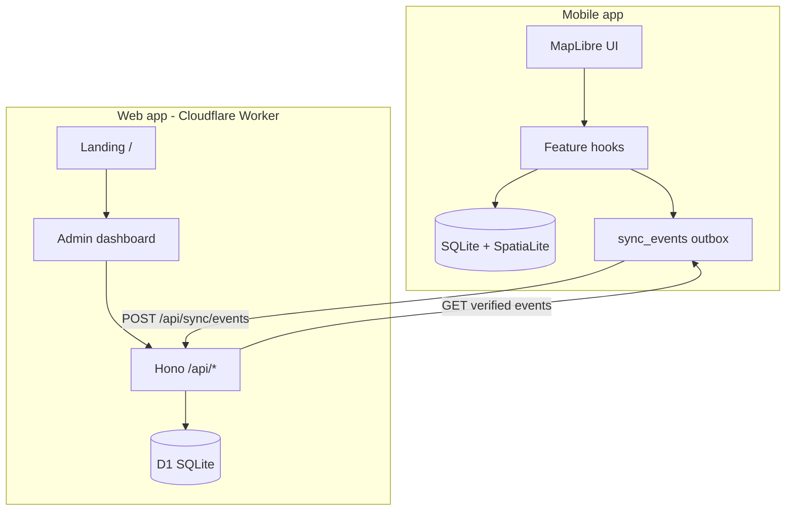

# Technical architecture — Karura Trails

## Product

**Karura Trails** is a forest trail system for Karura Forest: a mobile field app for maps, navigation, and marker capture, plus a web app that acts as the public landing page, admin dashboard, and sync hub for verified trail data.

| Surface       | Role                                                                                 |
| ------------- | ------------------------------------------------------------------------------------ |
| `apps/mobile` | Offline-first Expo app: MapLibre maps, SpatiaLite routing, field marker edits        |
| `apps/web`    | TanStack Start on Cloudflare Workers: landing, admin dashboard, auth, event sync API |

Branding lives in `apps/web/src/utils/system.tsx` (`AppConfig`) and `apps/mobile/brand.json`.

---

## Monorepo layout

| Path          | Role                                                         |
| ------------- | ------------------------------------------------------------ |
| `apps/mobile` | Expo Router app (iOS / Android)                              |
| `apps/web`    | TanStack Start app deployed to Cloudflare Workers + D1       |
| `packages/*`  | Shared TypeScript / ESLint configs (Turbo starter leftovers) |
| Root          | Turbo pipeline, Vite+ CLI (`vp`), workspace scripts          |

```
karura-trails/
├── apps/
│   ├── mobile/          # Expo + MapLibre + SpatiaLite (local SQLite)
│   └── web/             # TanStack Start + Hono + D1 (Cloudflare)
├── packages/
│   ├── eslint-config/
│   ├── typescript-config/
│   └── ui/              # stub component lib (not wired into apps yet)
├── ARCHITECTURE.md
└── README.md
```

---

## System overview



**Sync model (in progress):** mobile mutations emit events to a local outbox; the web worker stores them in D1; an admin verifies events in the dashboard; clients pull only verified events and replay locally. See `apps/mobile/docs/EVENT-SYNC-PLAN.md`.

---

## Mobile (`apps/mobile`)

### Stack

- **Expo SDK** + **Expo Router** (tabs: explore, navigate, markers, settings)
- **MapLibre** for map rendering
- **Drizzle ORM** over **op-sqlite** with **SpatiaLite** for spatial queries
- **React Native Paper** + forest-green brand tokens

### Layers

```
UI (screens, map layers, sheets)
  → hooks (useTrails, useDeviceLocation, useMarkerCapture, …)
  → data-access-layer / services
  → Drizzle + SpatiaLite (paths, points, landmark_types, …)
```

### Local database

SQLite on device. Key tables include `paths`, `points`, `landmark_types`, `point_neighbors`, and routing graph tables. Migrations: `apps/mobile/drizzle/`.

### Planned sync (client)

- `sync_events` outbox + `sync_cursor` (see EVENT-SYNC-PLAN)
- Push to `POST /api/sync/events`, pull from `GET /api/sync/events?after=…`
- Background sync via Expo TaskManager (not implemented yet)

Further detail: `apps/mobile/GAMEPLAN.md`, `apps/mobile/docs/`.

---

## Web (`apps/web`)

### Stack

- **TanStack Start** + **TanStack Router** (file-based routes, SSR)
- **@cloudflare/vite-plugin** — Workers runtime (no Nitro)
- **Hono** — `/api/*` routes (auth, sync, health)
- **Better Auth** `1.4.20` + **Drizzle** on **Cloudflare D1**
- **Tailwind CSS v4** + **DaisyUI**

### Runtime

`wrangler.jsonc` defines the Worker entry (`src/server.tsx`) and D1 binding `DB`. The worker routes `/api/*` to Hono; everything else goes through TanStack Start.

```
Request
  → /api/*     → honoApp (api-routes.ts)
  → /*         → TanStack Start (pages, SSR)
```

### Routes

| Route                   | Access | Purpose                                    |
| ----------------------- | ------ | ------------------------------------------ |
| `/`                     | Public | Landing page                               |
| `/auth`, `/auth/signup` | Public | Email/password (+ optional Google) sign-in |
| `/dashboard`            | Admin  | Map workspace placeholder                  |
| `/events`               | Admin  | Review and verify sync events              |

Admin routes use `beforeLoad` + `user.role === "admin"`. First signup matching `ADMIN_EMAIL` is auto-promoted.

### API (Hono)

| Endpoint                            | Purpose                                                                         |
| ----------------------------------- | ------------------------------------------------------------------------------- |
| `GET /api/health`                   | Health check                                                                    |
| `ALL /api/auth/*`                   | Better Auth handler                                                             |
| `POST /api/sync/events`             | Mobile push (batch, idempotent on event `id`)                                   |
| `GET /api/sync/events`              | Pull verified events (`after` cursor); admins can pass `includeUnverified=true` |
| `PATCH /api/sync/events/:id/verify` | Admin marks event verified                                                      |

Push auth: session cookie or `x-sync-secret` header (`SYNC_API_SECRET`).

### Data layer (D1)

| Table                                         | Purpose                                                 |
| --------------------------------------------- | ------------------------------------------------------- |
| Auth tables (`user`, `session`, `account`, …) | Better Auth                                             |
| `events`                                      | Sync event log (`verified`, `verifiedAt`, `verifiedBy`) |

Schema: `apps/web/src/lib/drizzle/schema/`  
DB client: `apps/web/src/db/d1.ts` (`createDb(env.DB)`)  
Migrations: `apps/web/drizzle/` → `pnpm db:migrate:local` / `db:migrate:remote`

### Key directories

```
apps/web/src/
├── routes/              # TanStack Router pages
│   ├── _dashboard/      # Admin shell + sidebar
│   └── auth/
├── server/
│   ├── api-routes.ts    # Hono app (exports honoApp)
│   ├── create-auth.ts   # Better Auth factory (per-request env)
│   └── sync-routes.ts
├── data-access-layer/   # Viewer session (React Query)
├── services/sync/       # Client fetch helpers for admin UI
├── components/          # Shared UI (sidebar, MainLoader, …)
└── db/d1.ts
```

---

## Auth

|         | Mobile          | Web                                                 |
| ------- | --------------- | --------------------------------------------------- |
| Status  | Not implemented | Better Auth on D1                                   |
| Methods | —               | Email/password (local dev), Google OAuth (optional) |
| Admin   | —               | `user.role === "admin"`                             |

Web secrets live in Cloudflare bindings (`.dev.vars` locally). Client URL: `VITE_API_URL`.

---

## Tooling

| Tool          | Use                                         |
| ------------- | ------------------------------------------- |
| `pnpm`        | Workspace package manager                   |
| `turbo`       | `dev`, `build`, `check-types` across apps   |
| `vp` (Vite+)  | Web dev/build/lint/format                   |
| `wrangler`    | Local D1, deploy, secrets                   |
| `drizzle-kit` | Schema migrations (web + mobile separately) |
| `eas`         | Mobile builds (`apps/mobile`)               |

---

## Environment

### Web — Vite (`.env`)

```bash
VITE_API_URL=http://localhost:3050
VITE_GOOGLE_AUTH_ENABLED=false   # set true when Google OAuth is configured
```

### Web — Worker (`.dev.vars`, copy from `.dev.vars.example`)

```bash
BETTER_AUTH_SECRET=...           # min 32 characters
BETTER_AUTH_URL=http://localhost:3050
CORS_ORIGINS=http://localhost:3050
ADMIN_EMAIL=you@example.com      # auto-promoted to admin on signup
SYNC_API_SECRET=...              # mobile push in dev (x-sync-secret header)
GOOGLE_CLIENT_ID=                # optional
GOOGLE_CLIENT_SECRET=            # optional
```

Production: set the same keys via `wrangler secret put` and update `database_id` in `wrangler.jsonc`.

### Mobile

Uses `APP_VARIANT` (development / preview / production) and Expo env vars. See `apps/mobile/app.config.ts`.

---

## Deployment

### Web → Cloudflare Workers

1. `wrangler d1 create karura-trails-db` — put `database_id` in `wrangler.jsonc`
2. `pnpm db:migrate:remote` (from `apps/web`)
3. Set secrets (`BETTER_AUTH_SECRET`, etc.)
4. `pnpm deploy` (from `apps/web`)

Build output: `dist/server/` (worker) + `dist/client/` (static assets).

### Mobile → EAS

See `apps/mobile` EAS profiles in `eas.json`. Local dev builds via `expo run:android` / `expo run:ios`.

---

## What's next

| Area                                                             | Status                         |
| ---------------------------------------------------------------- | ------------------------------ |
| Mobile sync outbox + background push/pull                        | Planned (`EVENT-SYNC-PLAN.md`) |
| Web map workspace (transplant from other project)                | Placeholder                    |
| User (non-admin) dashboard                                       | Future                         |
| Domain tables on D1 (replay verified events into `points`, etc.) | Future                         |

---

## Further reading

- [TanStack Start](https://tanstack.com/start)
- [TanStack Router](https://tanstack.com/router)
- [Cloudflare D1](https://developers.cloudflare.com/d1/)
- `apps/mobile/GAMEPLAN.md` — mobile product and schema
- `apps/mobile/docs/EVENT-SYNC-PLAN.md` — sync protocol
- `apps/web/AGENTS.md` — web coding conventions (if present)
