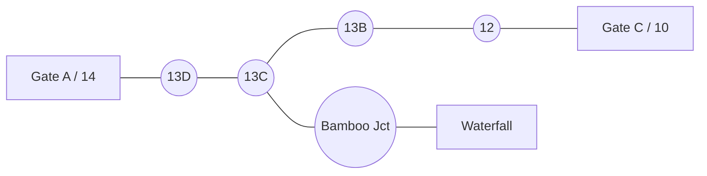

# Karura Trails — Segment Graph, Field Data Collection & Lightweight Navigation Plan

This plan covers the next major evolution of the app, in three tightly-related pillars:

1. **Segment graph model** — break monolithic trails into points + segments that link into a routable graph.
2. **Field data collection** — use the app itself to capture and correct markers (intersections + landmarks) before launch.
3. **Lightweight wayfinding** — persistent "which way at the next intersection" hints (no expensive turn-by-turn provider), plus precomputed routes and on-the-fly diversion.

It also specifies what the **desktop modeling app** should export, in what format, so the mobile app can ingest it cleanly.

---

## 1. Concept & Vision

### 1.1 From monolithic trails to a segment graph

Today each trail is one long `LineStringZ` with rich per-vertex elevation. We keep that rich geometry, but reframe the forest as a **graph**:

- **Node** = a labeled `point` (intersection `13B`, gate `Gate A`, landmark `Waterfall`).
- **Segment (edge)** = the stretch of trail geometry between two adjacent nodes, with its own elevation/distance stats.
- **Route** = an ordered list of segments (precomputed "follow this" experiences).
- **Diversion** = at any node a user can abandon the precomputed route and continue on any other segment leaving that node — exploration stays first-class.



A "trail" for a casual user becomes a **named route** (a chain of segments). A power user just wanders node-to-node. Same graph, two experiences.

### 1.2 Why segments instead of whole trails

- **Routing**: shortest / loop / gate-to-gate paths need edges between decision points, not one 500-vertex blob.
- **Diversion**: choices only exist at nodes; segments are the atomic "next move".
- **Reuse**: one physical segment can belong to many routes without duplication.
- **Rich data preserved**: each segment still stores its slice of the original `LineStringZ` (elevation intact).

### 1.3 Non-goals (YAGNI for v1)

- No external routing/turn-by-turn provider (Mapbox/Google Directions). Cost + overkill.
- No voice guidance, no lane-level instructions.
- No automatic GPS-based marker placement (Karura GPS is unreliable — see §4).
- No social/multi-user routing.

---

## 2. Data Model

We **extend**, not replace, the existing schema (`paths`, `points`, `path_points`, `hikes`, `hike_waypoints`). The original `paths` LineStrings remain as the **source geometry** that segments are carved from.

### 2.1 Reuse existing tables

| Table         | Role in graph model                                                                                                    |
| ------------- | ---------------------------------------------------------------------------------------------------------------------- |
| `points`      | Graph **nodes**. Already has `category` (`junction`, `gate`, `viewpoint`, …), elevation, nearest-path denormalization. |
| `paths`       | **Source geometry** trails (rich `LineStringZ`). Segments reference a slice of these.                                  |
| `path_points` | Already maps a point → position-on-path (`position_on_path` 0–1). This is exactly how we cut segments.                 |

### 2.2 New: `segments` table

A segment is the edge between two consecutive nodes along one source path.

| Column                      | Type                   | Description                                                                                          |
| --------------------------- | ---------------------- | ---------------------------------------------------------------------------------------------------- |
| `id`                        | INTEGER PK             |                                                                                                      |
| `slug`                      | TEXT UNIQUE            | Stable id e.g. `13b-13c`                                                                             |
| `name`                      | TEXT                   | Optional human label ("13B → 13C")                                                                   |
| `source_path_id`            | INTEGER FK → paths.id  | Which trail this slice came from                                                                     |
| `from_point_id`             | INTEGER FK → points.id | Node at start                                                                                        |
| `to_point_id`               | INTEGER FK → points.id | Node at end                                                                                          |
| `start_fraction`            | REAL                   | `position_on_path` of `from_point` (0–1)                                                             |
| `end_fraction`              | REAL                   | `position_on_path` of `to_point` (0–1)                                                               |
| `distance_meters`           | REAL                   | Length along geometry                                                                                |
| `elevation_gain`            | REAL                   | Cumulative ascent on this slice                                                                      |
| `elevation_loss`            | REAL                   | Cumulative descent on this slice                                                                     |
| `min_elevation`             | REAL                   |                                                                                                      |
| `max_elevation`             | REAL                   |                                                                                                      |
| `bidirectional`             | INTEGER (bool)         | Almost always true for forest trails                                                                 |
| `surface_type`              | TEXT                   | Inherited/overridable                                                                                |
| `difficulty`                | TEXT                   | Inherited/overridable                                                                                |
| `geom`                      | BLOB (LineStringZ)     | Materialized slice (`ST_Line_Substring(source.geom, start, end)`) for instant draw without recutting |
| `created_at` / `updated_at` | TEXT                   |                                                                                                      |

**Why materialize `geom`?** So drawing a route is just `UNION` of segment geometries — no runtime substring math, no fetching whole 500-vertex paths.

### 2.3 New: `routes` + `route_segments` (precomputed "follow this")

`routes` = curated/auto-generated experiences (a loop, a gate-to-gate, "to the waterfall").

| `routes` column                  | Type                   | Description                                |
| -------------------------------- | ---------------------- | ------------------------------------------ |
| `id`                             | INTEGER PK             |                                            |
| `slug`                           | TEXT UNIQUE            |                                            |
| `name`                           | TEXT                   | "Gate A → Waterfall → Gate C"              |
| `kind`                           | TEXT                   | `loop` / `point_to_point` / `out_and_back` |
| `entry_point_id`                 | INTEGER FK → points.id | Usually a gate                             |
| `exit_point_id`                  | INTEGER FK → points.id | Usually a gate                             |
| `total_distance_meters`          | REAL                   |                                            |
| `total_elevation_gain` / `_loss` | REAL                   |                                            |
| `difficulty`                     | TEXT                   |                                            |
| `is_curated`                     | INTEGER (bool)         | Hand-made vs auto-generated                |

| `route_segments` column | Type                     | Description                    |
| ----------------------- | ------------------------ | ------------------------------ |
| `id`                    | INTEGER PK               |                                |
| `route_id`              | INTEGER FK → routes.id   |                                |
| `segment_id`            | INTEGER FK → segments.id |                                |
| `sequence`              | INTEGER                  | Order 0,1,2…                   |
| `traverse_reversed`     | INTEGER (bool)           | If walking the segment to→from |

> `hikes` / `hike_waypoints` stay for **recorded** activity. `routes` are the **planned/precomputed** product. Keep them separate (different lifecycles).

### 2.4 The runtime graph (in-memory, derived)

We do **not** invent a new persisted graph table. At load we build an adjacency list in JS from `segments`:

```
GraphNode  = { pointId, label, category, lng, lat, elevation }
GraphEdge  = { segmentId, fromPointId, toPointId, weightMeters, bidirectional }
Graph      = Map<pointId, GraphEdge[]>
```

Build is O(segments), trivial for Karura scale (tens of nodes, low hundreds of segments). Rebuild only when data changes.

### 2.5 Marker types & their navigational role

| Category                                                            | Routable node?        | Used for                            | Notes                                             |
| ------------------------------------------------------------------- | --------------------- | ----------------------------------- | ------------------------------------------------- |
| `junction`                                                          | **Yes**               | Decisions, edges meet here          | The ones we care most about                       |
| `gate`                                                              | **Yes**               | Entry/exit, route endpoints         | Special junction                                  |
| `waterfall` / `viewpoint` / `cave` / `rest_area` / `water` / `sign` | Usually **no** (leaf) | Situational awareness, destinations | Can be a route target even if not a decision node |
| `custom`                                                            | Maybe                 | User pins                           |                                                   |

A landmark like the waterfall can be a **destination** node attached to the nearest segment even if it isn't a true intersection.

---

## 3. Desktop Modeling App — Export Contract

The desktop app is the **source of truth for graph topology** (you label points and link them). It must export something the mobile app can ingest deterministically.

### 3.1 What the desktop app should add

1. **Point labeling** — every marker gets a stable `ref` (e.g. `13B`, `GATE_A`) + `category`.
2. **Point geometry** — `lng`, `lat`, and (if known) `elevation`. If elevation unknown, leave null; mobile infers from path.
3. **Segment linking** — the ability to say "point X connects to point Y along path Z". This is the critical new capability. Ideally you click two adjacent points on a path and it records the slice between them.
4. **Position-on-path** — for each (point, path) it should compute and export `position_on_path` (0–1). This is what lets us cut segments precisely. If the desktop app uses a real geometry library, compute it there; otherwise mobile recomputes via SpatiaLite `ST_Line_Locate_Point`.
5. **Route authoring (optional, later)** — order segments into named routes.

### 3.2 Export format — a single versioned GeoJSON bundle (or JSON)

Prefer **one JSON file** with three feature collections, versioned. Keep the rich `paths.geojson` you already have as the geometry source; add `points` and `links`.

```jsonc
{
  "version": 2,
  "generatedAt": "2026-06-02T14:00:00Z",
  "bbox": [36.7944, -1.25081, 36.84418, -1.22436],

  "paths": {
    /* existing trails.geojson FeatureCollection, unchanged */
  },

  "points": {
    "type": "FeatureCollection",
    "features": [
      {
        "type": "Feature",
        "geometry": { "type": "Point", "coordinates": [36.825, -1.242, 1680] },
        "properties": {
          "ref": "13B",
          "name": "Junction 13B",
          "category": "junction",
          "elevation": 1680,
          "elevationSource": "manual",
        },
      },
      {
        "type": "Feature",
        "geometry": { "type": "Point", "coordinates": [36.831, -1.238] },
        "properties": { "ref": "WATERFALL", "name": "Karura Waterfall", "category": "viewpoint" },
      },
    ],
  },

  "links": [
    {
      "fromRef": "13B",
      "toRef": "13C",
      "pathSlug": "blue-trail-142777583",
      "startFraction": 0.41,
      "endFraction": 0.47,
      "bidirectional": true,
    },
  ],
}
```

### 3.3 Format rules (so ingestion is deterministic)

- `ref` is **stable + unique** across exports. Never reuse a ref for a different physical marker. This is the join key.
- Coordinates are `[lng, lat]` or `[lng, lat, elevation]`. Always WGS84 (EPSG:4326).
- `links` reference points by `ref` and a path by `slug` (the slug already exists on `paths`).
- `startFraction` < `endFraction` not required; mobile normalizes and sets `traverse_reversed`.
- If the desktop app can't compute fractions, omit them and instead provide the **two coordinates**; mobile derives fractions via `ST_Line_Locate_Point`. Document which mode you're using in `version` / a `fractionsProvided: boolean` flag.
- Export is **idempotent**: re-importing upserts by `ref` / `(fromRef,toRef,pathSlug)`.

### 3.4 Suggested desktop app improvements (priority order)

1. **Two-click segment tool**: pick point A, pick point B on the same path → auto-create a link with fractions. Highest leverage.
2. **Ref auto-suggest + uniqueness guard**.
3. **Validation panel**: warn on (a) points not within N meters of any path, (b) junctions with only one segment, (c) duplicate refs, (d) dangling links.
4. **Elevation pull**: sample elevation from the path at each point so `points` carry elevation.
5. **Bundle export** in the format above + a JSON Schema we both validate against.

---

## 4. Field Data Collection Mode (in the mobile app)

Goal: while wandering, a user encounters a physical marker and records it. **GPS is unreliable in Karura**, so capture is **map-assisted manual**, not raw GPS.

### 4.1 Capture flow

1. User opens "Add marker" (FAB on map or long-press).
2. A draggable crosshair/pin appears at map center with a **live coordinate readout** (`lng, lat`).
3. User pans/zooms the basemap and positions the pin where the marker _looks_ right (visual ground-truthing against trail lines / known features), **not** trusting the GPS dot.
4. Optionally tap "Use my GPS" to seed the pin, then nudge.
5. Fill the form (see §4.3), see a **preview marker** on the map immediately.
6. Save → writes to `points` (+ auto `path_points` linking, + elevation inference from nearest path).

### 4.2 Why manual placement

- Karura canopy + terrain → GPS drift of tens of meters.
- The map (trail lines, junctions, water) gives better positional context than the GPS fix.
- Matches your workflow: "look at the map, decide if the pointer is where it should be, then jot the coordinates."

### 4.3 Capture inputs

| Field         | Input                                                                                      | Required            | Notes                                |
| ------------- | ------------------------------------------------------------------------------------------ | ------------------- | ------------------------------------ |
| Coordinates   | Map crosshair + editable lat/lng text fields                                               | Yes                 | Manual override always allowed       |
| `ref`         | Text                                                                                       | For junctions/gates | Stable label for graph join          |
| `name`        | Text                                                                                       | Optional            |                                      |
| `category`    | Chips (junction / gate / viewpoint / waterfall / water / cave / rest_area / sign / custom) | Yes                 | Drives icon + routable flag          |
| `elevation`   | Auto-inferred, editable                                                                    | Auto                | From nearest path; user can override |
| `photo`       | Camera                                                                                     | Optional            | `photo_uri`                          |
| `description` | Text                                                                                       | Optional            |                                      |
| Nearest path  | Auto-computed, shown read-only                                                             | Auto                | `nearest_path_id/name/distance`      |

### 4.4 Two marker classes (per your description)

- **Decision markers** (`junction`, `gate`): drive routing. Must have `ref`. We actively want these.
- **Situational markers** (`viewpoint`, `waterfall`, etc.): not for turning, but give "you are near X" awareness and can be route destinations.

### 4.5 Editing & QA

- Tap a marker → edit/move/delete (gated to data-collection / dev mode initially).
- "Unverified" flag until someone confirms placement; a verification toggle.
- Export captured points back out (to feed the desktop app) — same bundle format §3.2, reversed direction.

---

## 5. Lightweight Wayfinding (no turn-by-turn provider)

### 5.1 What the user sets at start

A minimal **objective**, not a route:

- **From** (often the gate they entered) — optional, can be inferred.
- **To / objective** (a node: another gate, the waterfall, "back to Gate C").
- **Style** (optional): shortest, loop, scenic.

### 5.2 The persistent arrow / next-decision hint

Instead of step-by-step, we continuously answer one question: **"At the next intersection ahead of me, which way?"**

```
Loop (on each location update):
  1. Snap user to nearest segment + position.
  2. Compute shortest path (Dijkstra/A*) from the user's current node
     (or the node at the end of the current segment) to the objective.
  3. The next node on that path = the upcoming decision point.
  4. Render:
       - a persistent directional arrow (bearing from user → next decision node, or relative turn at it)
       - "Next: turn toward 13C at the junction ~120 m ahead"
       - distance to that junction
  5. If user diverts (takes another segment), recompute next time — no penalty, exploration is fine.
```

This is cheap: one Dijkstra per recompute over a tiny graph. No external API.

### 5.3 Turn semantics (simple, not lane-level)

At a decision node, compute the **bearing of the incoming segment** vs the **bearing of the chosen outgoing segment** → classify as `left` / `slight left` / `straight` / `slight right` / `right` / `back`. That's enough for "head left at the next junction."

### 5.4 Gate-to-gate / loop patterns

| User intent                               | Computation                                                                                                                                  |
| ----------------------------------------- | -------------------------------------------------------------------------------------------------------------------------------------------- |
| Enter Gate A → exit Gate C                | shortest path Gate A node → Gate C node                                                                                                      |
| Enter Gate A → Waterfall → back to Gate A | route A → Waterfall, then Waterfall → A with the just-used first segment penalized (avoid immediate backtrack) → forms a loop where possible |
| "Circle back to where I came from"        | shortest path current → entry node                                                                                                           |
| Free explore, keep me oriented            | objective optional; arrow points to entry/"home" node so they can always get back                                                            |

### 5.5 Algorithm & complexity

- **Dijkstra** (binary heap) or **A\*** (great-circle heuristic to goal). Weight = segment `distance_meters` (optionally elevation-adjusted later).
- Graph: ~tens of nodes, hundreds of edges → **sub-millisecond** per query on-device.
- Build graph once: O(E). Snap GPS: O(E) naive or spatial-index assisted.
- No re-implementation of anything heavy; a ~100-line Dijkstra utility in `src/geo/`.

---

## 6. Bottom Sheet Redesign (on-trail context)

When raised, the sheet shows **graph-aware** context, not just trail stats.

**Peek (collapsed):**

- Segment name + the **node you're approaching** ("Approaching 13C, ~120 m").
- Compact elevation window (already built: `TrailElevationWindowChart`).
- The persistent direction arrow + objective summary if navigating.

**Expanded:**

1. **Closest point** (nearest node behind/at you) + category icon.
2. **Approaching point** (next node ahead) + distance + turn hint.
3. **Current segment** info: distance, gain/loss, difficulty, surface.
4. **Elevation** window chart for the segment.
5. **Up to 5 next options** — the segments leaving the upcoming node. Each row: destination label, distance, gain/loss, and where it ultimately heads ("→ toward Gate C"). Tapping one **draws that branch on the map** (preview polyline) and, if it matches the objective, highlights it.
6. If navigating: objective + ETA-ish (distance remaining) + "recompute / change objective".

This directly maps to your description: _closest point, approaching point, current segment, elevation, then a list of ~5 possible combinations you can embark on, tap to draw._

---

## 7. Services / Hooks / Components (where code lands)

Following project conventions (services per domain, hooks for logic, presentation-only components, geo types in `src/geo/`).

```
src/
├── geo/
│   ├── graph/
│   │   ├── build-graph.ts          ← segments → adjacency list
│   │   ├── dijkstra.ts             ← shortest path (+ A* option)
│   │   ├── snap-to-graph.ts        ← GPS → nearest segment/node
│   │   ├── turn-classifier.ts      ← bearing delta → left/right/straight
│   │   └── graph.types.ts          ← GraphNode/GraphEdge/RouteResult
│   └── segments/
│       └── cut-segment.ts          ← fraction slice helpers (JS lerp)
├── services/
│   ├── ingest/
│   │   └── bundle-import.service.ts ← parse + upsert the desktop bundle
│   ├── segments/
│   │   └── segments.service.ts      ← CRUD + materialize geom (ST_Line_Substring)
│   └── routing/
│       └── routing.service.ts       ← orchestrate snap+dijkstra+turns
├── hooks/
│   ├── use-route-graph.ts           ← memoized graph (rebuild on data change)
│   ├── use-navigation-objective.ts  ← from/to/style state (persisted)
│   ├── use-next-decision.ts         ← per-location next-node + turn hint
│   └── use-marker-capture.ts        ← field collection form logic
├── components/
│   ├── map/
│   │   ├── route-preview-layer.tsx  ← draw selected branch/route
│   │   └── direction-arrow.tsx      ← persistent heading arrow overlay
│   └── trails/
│       ├── segment-options-list.tsx ← the "5 next options" list
│       └── marker-capture-sheet.tsx ← add/edit marker form
└── lib/drizzle/schema/
    ├── segments.ts
    ├── routes.ts
    └── route-segments.ts
```

Types stay colocated (per `AGENTS.md`): graph types in `src/geo/graph/`, DB types from each schema file.

---

## 8. Implementation Phases

### Phase A — Schema + ingestion (no UI risk)

1. Add `segments`, `routes`, `route_segments` Drizzle schemas + migration.
2. `bundle-import.service.ts`: parse the §3.2 bundle, upsert `points`/`links`, materialize `segments.geom` via `ST_Line_Substring`, compute distance/elevation stats.
3. Backfill `path_points` fractions where missing (`ST_Line_Locate_Point`).
4. Validation report (dangling links, lone junctions).

### Phase B — Graph + routing core (pure logic, unit-testable)

1. `build-graph.ts`, `dijkstra.ts`, `snap-to-graph.ts`, `turn-classifier.ts`.
2. `use-route-graph`, `routing.service`.
3. Unit tests: known graph → expected shortest path; turn classification; loop with backtrack penalty.

### Phase C — Field data collection

1. `marker-capture-sheet` + `use-marker-capture` (map crosshair, manual lat/lng, category, photo, elevation inference).
2. Edit/move/delete + unverified flag.
3. Export captured points as a bundle (feed back to desktop).

### Phase D — Wayfinding UI

1. `use-navigation-objective` (set from/to at start; persisted).
2. `use-next-decision` + `direction-arrow` overlay.
3. Bottom sheet redesign (closest/approaching/segment/elevation + 5 options).
4. `route-preview-layer` to draw tapped branch / chosen route.

### Phase E — Precomputed routes & diversion

1. Curated `routes` rendering ("follow this").
2. Diversion: leaving a route at a node seamlessly switches to free-explore while keeping the objective arrow.

---

## 9. Open Questions / Decisions to Lock

1. **Fractions: desktop or mobile?** Prefer desktop-computed (`startFraction`/`endFraction`) for determinism; mobile fallback via SpatiaLite. Decide and set `fractionsProvided` in the bundle.
2. **Node identity at junctions** — when multiple paths meet, is it one `ref` shared by all incoming segments? (Required so the graph actually connects.) Recommend: **yes, one node per physical junction**, desktop enforces it.
3. **Bidirectional default** — treat all forest segments as walkable both ways unless flagged. Recommend yes.
4. **Elevation-weighted routing** — v1 distance only; add an "easiest" mode later weighting gain.
5. **Loop generation** — curated routes first; auto-loop generation (longest-simple-cycle under X km) is a later, harder feature.
6. **Bundle delivery** — bundled asset shipped with the app, or downloaded/updated over the air? (Affects when graph rebuilds.)

---

## 10. Summary

- Keep rich trail geometry; add a **point + segment graph** on top of it.
- Desktop app exports a **versioned JSON bundle** (`paths` + `points` + `links`) keyed by stable `ref`s; its biggest new feature is a **two-click segment linker**.
- Mobile app gains a **map-assisted manual marker capture** mode (GPS-distrustful) to gather and verify the points.
- Navigation is **cheap Dijkstra/A\*** over a tiny graph producing a **persistent next-intersection arrow** + a **5-option branch list** in the bottom sheet — no paid turn-by-turn.
- Everything is phased so schema/ingest/routing logic land before UI, and exploration/diversion stays first-class throughout.
